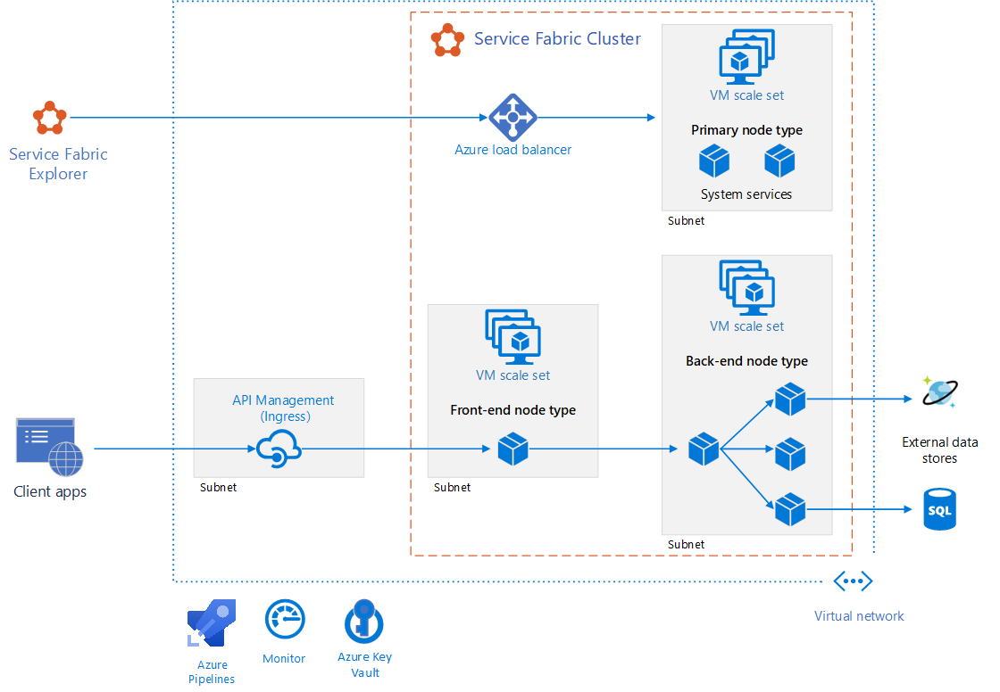

# SVASTHA
SVASTHA is a microservice powered personal health journey dashboard for viewing activity from wearable IOT data device.

> This project is created as part of [Azure Innovation Challenge](https://innovationchallenge.devpost.com/)

# Data & Technology Used

- [FitBit Fitness Tracker Data](https://www.kaggle.com/datasets/arashnic/fitbit?resource=download)  (public domain)
- Azure service fabric
- Azure API management
- Github Actions

# Reference Architecture

# Design Rationale ## 

[Azure Service Fabric](https://azure.microsoft.com/en-us/services/service-fabric/) provides a way to easily build and deploy Microservice into scalable clusters. Coupling microservice architecture with routing API requests for different end points will give flexibility to cloud teams to build enterprise scale applications one service at a time.

Backward compatibility is maintained as new features are being built as API management gateway is aware of routing needs for a version of an API that is being requested.

# Current Features ##
- Get fitness data

# Future Enhancements ##
- Realtime streaming data display

# Getting started
- Install VS2019 
- [Install Service Fabric SDK](https://docs.microsoft.com/en-us/azure/service-fabric/service-fabric-get-started)
- Clone this Repo
- Install node 8.1.2 (or switch to 8.1.2 using [nvm](https://github.com/nvm-sh/nvm))
- After building the Service Service Cluster the micro service applications can be accessed on [Cluster Explorer](http://localhost:19080/Explorer)
